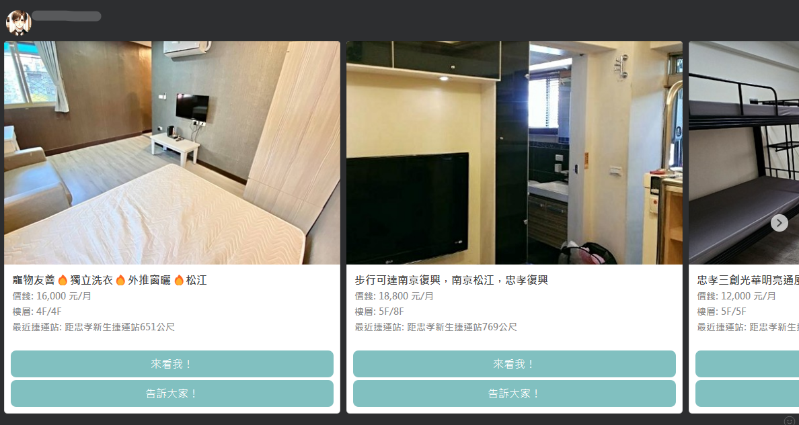

# LivingHelper

Help me find the most ideal rental place.

## Environment

- Python 3.8.18

- Dependencies
`
$ pip install -r requirements.txt
`

## Usage

1. use crontab to run the scripts (`house591_spider.py`)

2. try to deploy on AWS Lambda

## Demo

